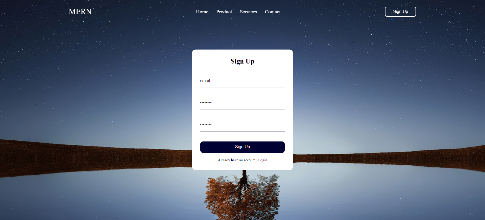
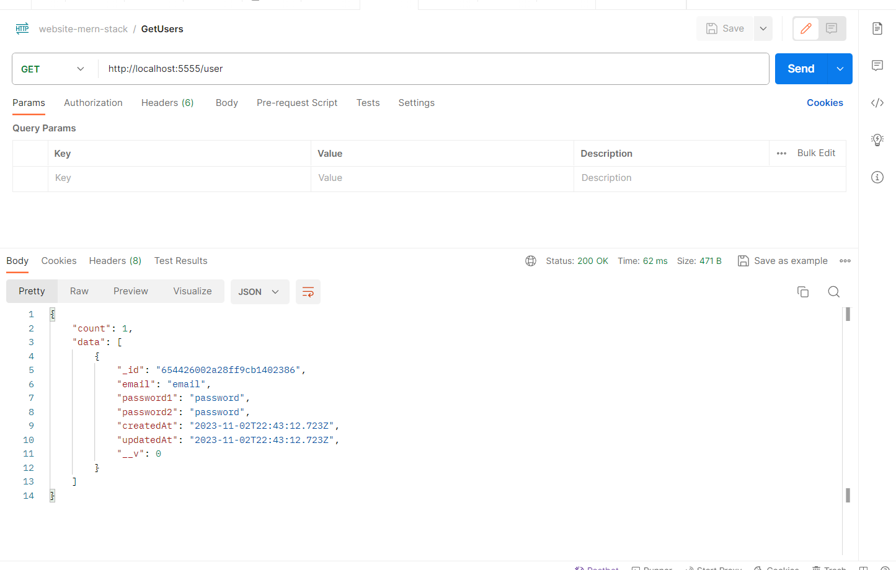
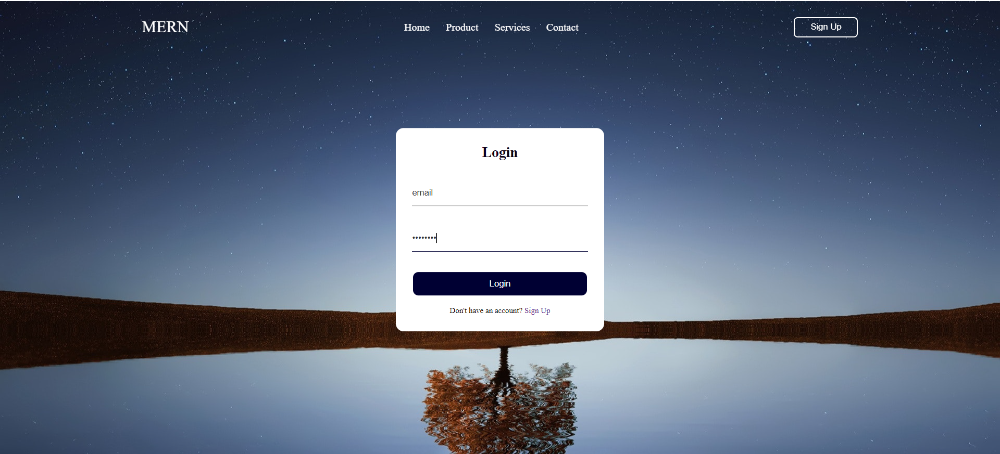
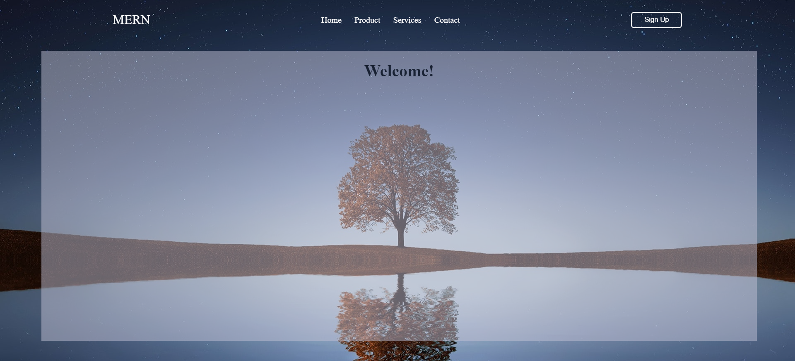

# website-mern-stack

As the name suggested, the website-mern-stack is simply a website built with MongoDB, Express, React, and NodeJS (MERN). Here, users can sign up for an account, and thereafter, they can login any time using their credentials they have created.

The purpose of this application is mainly to get our hands on the MERN technologies and how to use them to develop a full-stack application. In this case, a website.

## Setup / Installation

### 1. Prerequisites

Please install the following if you have not already:

* Git
* Node.JS
* MongoDB account
* Visual Studio Code

### 2. Cloning the repository

* Click the "Code" (green) button and copy the HTTPS URL
* Then navigate to your terminal and type the following, replacing the URL with your copied one

```sh
$ git clone https://github.com/<"username">/<"repo-name">.git
```

### 3. Navigating to the project directory

```sh
$ cd <repo-name>
```

### 4. Opening code in VS Code

```sh
$ code .
```

### 5. Running the backend
In the VS Code, open a terminal. Do the following steps to run the server:

```sh
$ cd backend
$ npm i
npm run dev
```

### 6. Running the frontend
Open another terminal. Do the following steps to run the client:

```sh
$ cd frontend
$ npm i
npm run dev
```

Click the link in the terminal to see the project on the web browser.

## Built with

### Frontend
* React.JS
### Backend
* Express.JS
* Node.js
### Database
* MongoDB

## Screenshots of this project

Register page


User's credentials are created and recorded in the database


Login page


After successful registration or login, user will be redirected to the User page


## Acknowledgments

* The frontend was inspired and tutored from CodingLab - Create Website with Login & Registration Form in HTML CSS & JavaScript: https://www.youtube.com/watch?v=etsPyHLON7g.

